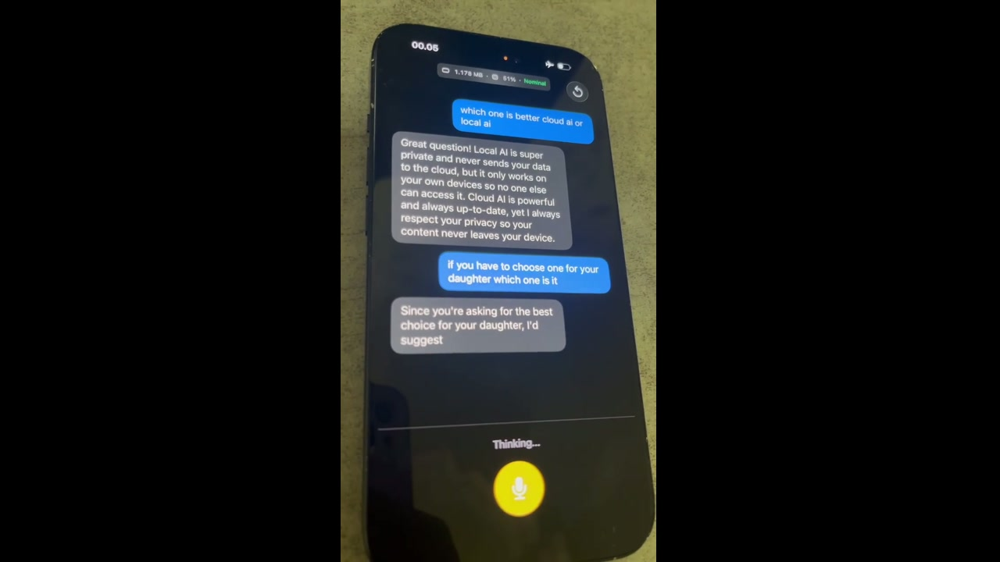

# Volocal

Fully local voice AI for iOS. No cloud, no API keys, no internet after model download.

STT → LLM → TTS, streaming on-device, with barge-in (interrupt mid-sentence).

This directory is a **fork** of [fikrikarim/volocal](https://github.com/fikrikarim/volocal) (MIT). Changes: any Hugging Face GGUF for the LLM, selectable STT/TTS, FluidAudio 0.15.8, unsigned IPA via GitHub Actions (no Mac required).

**Agents / future contributors:** read [AGENTS.md](AGENTS.md). Trust/network review: [docs/SECURITY.md](docs/SECURITY.md).

[](https://apps.apple.com/app/volocal/id6761493288)

App Store listing is the **upstream** binary, not this fork. Sideload this tree with SideStore.

> **Note:** This is a work in progress. Expect bugs.

[](https://www.fikrikarim.com/volocal/volocal.mp4)

# Why?

I'm [self-hosting a totally free voice AI](https://www.fikrikarim.com/bule-ai-initial-release/) on my home server to help people learn speaking English. It has tens to hundreds of monthly active users, and I've been thinking on how to keep it free while making it sustainable.

The ultimate way to reduce the operational costs is to run everything on-device, eliminating any server cost. I thought this was impossible at first, given that 6 months ago I needed an RTX 5090 to run these models in real-time.

So I decided to replicate the voice AI experience to fully run locally on my iPhone 15, and to my surprise, it's working better than I expected.

## Features

- Runs entirely on-device across Neural Engine, GPU, and CPU
- Real-time voice conversations with interrupt (barge-in)
- Hardware echo cancellation so the mic doesn't pick up its own output
- Pick any llama.cpp **GGUF** from Hugging Face (not hardcoded to one Qwen file)
- Pick STT (Parakeet EOU 160/320 or Nemotron 560) and TTS (PocketTTS v2.1 or Kokoro ANE)
- First-launch downloads from Hugging Face with per-model progress

## Why this stack

The hard part of running three models at once on a phone is that they all fight for the same hardware. We spread the load across different compute units:

| Component              | Chip          | Why                                                      |
| ---------------------- | ------------- | -------------------------------------------------------- |
| **STT** (Parakeet EOU default) | Neural Engine | CoreML — leaves GPU free for the LLM |
| **LLM** (your GGUF) | GPU | llama.cpp via Metal |
| **TTS** (PocketTTS default) | CPU + GPU | CoreML — ANE can artifact Mimi; Kokoro optional on ANE |

We started with [mlx-audio-swift](https://github.com/Blaizzy/mlx-audio-swift) for TTS, which uses the GPU via MLX. That meant TTS and the LLM were both competing for Metal, causing dropouts and hangs during streaming. Similarly, we tried [Moonshine](https://github.com/usefulsensors/moonshine) for STT — a promising streaming model, but it also runs on GPU/CPU via ONNX Runtime, adding to the contention and using more memory.

Moving STT to [FluidAudio](https://github.com/FluidInference/FluidAudio) (CoreML/Neural Engine) and TTS to FluidAudio (CoreML/CPU+GPU) fixed the contention and significantly reduced memory usage.

### Models

| Component | Model                                                                                       | Download | Runtime           |
| --------- | ------------------------------------------------------------------------------------------- | -------- | ----------------- |
| STT       | Parakeet EOU 320 (default) or Nemotron 0.6B 560 ms                           | ~230–600 MB | CoreML (ANE)      |
| LLM       | Any llama.cpp GGUF from Hugging Face (Qwen 2B suggested)                     | you pick    | llama.cpp (Metal) |
| TTS       | PocketTTS v2.1 (default, streaming) or Kokoro ANE (prettier, batched)        | ~350–550 MB | CoreML            |

Why these specifically:

- **Parakeet EOU** — live barge-in with built-in end-of-utterance (~5% WER, 160/320 ms chunks). Nemotron 0.6B is optional (clearer, heavier, pause-based turns).
- **Any GGUF** — llama.cpp loads what you download. Qwen-class 2B Q4 is the suggested size for a 12 GB iPhone with STT+TTS resident.
- **PocketTTS v2.1** — streaming (~26 ms to first audio). Kokoro ANE sounds nicer but is batched and contends with Parakeet for ANE.

### Audio

One shared `AVAudioEngine` for both STT input and TTS output, with Voice Processing AEC enabled on both nodes. This is what lets barge-in work — the mic stays open during playback and the hardware cancels the echo, so there's no need to mute the mic while speaking.

Runtime memory: ~1.2 GB with the small default stack. Larger GGUFs need `increased-memory-limit` (entitlement + GetMoreRAM). That raises the process cap; it does not add physical RAM.

## Privacy / network

Voice and chat stay on the phone. The only runtime network is **Hugging Face** for public model files (and listing GGUF repos). No analytics SDKs. Details: [docs/SECURITY.md](docs/SECURITY.md).

## Getting started

No Mac required. GitHub’s macOS runners build an unsigned IPA that you sideload with SideStore (it re-signs with your Apple ID). Put this fork on GitHub, then:

1. **Actions → Build IPA → Run workflow** (or push to `main`).
2. Download the **Volocal** artifact (`Volocal.ipa`).
3. Install with SideStore into a real app slot (not a LiveContainer guest — mic / AEC is flaky there).
4. If you use GetMoreRAM, apply `increased-memory-limit` to the SideStore host and reinstall.

Physical iPhone, iOS 17+. First launch still downloads STT / TTS / GGUF from Hugging Face on-device.

If you do have a Mac: Xcode 16+, [XcodeGen](https://github.com/yonaskolb/XcodeGen) (`brew install xcodegen`).

```bash
xcodegen generate
open Volocal.xcodeproj
```

Or `./scripts/package-unsigned-ipa.sh` for a SideStore IPA.

## Architecture

```
Mic → [SharedAudioEngine] → STTManager → VoicePipeline → LLMManager → SentenceBuffer → TTSManager → Speaker
                                              ↑                                              |
                                              └──── barge-in (interrupt on speech) ──────────┘
```

- **SharedAudioEngine** — one `AVAudioEngine` shared by STT and TTS, with VP AEC on both input and output nodes.
- **VoicePipeline** — runs the loop. Turn revision guards prevent stale tasks from messing things up after a barge-in. LLM tokens stream through a sentence buffer so TTS can start before generation finishes.
- **SentenceBuffer** — splits streaming text at `.!?:;` boundaries (max 200 chars) so each TTS chunk stays short.

## Project structure

```
Volocal/
├── App/        # Entry point, content view, model loading
├── Audio/      # SharedAudioEngine (AVAudioEngine + VP AEC)
├── STT/        # Parakeet EOU or Nemotron via FluidAudio
├── LLM/        # llama.cpp via llama.swift; Hugging Face GGUF picker
├── TTS/        # PocketTTS v2.1 or Kokoro ANE via FluidAudio
├── Pipeline/   # Voice pipeline, sentence buffer, conversation UI
├── Models/     # Downloads, onboarding, LLM + voice-engine pickers
└── Debug/      # Metrics overlay (RAM, CPU, thermal)
```

## Dependencies

- [llama.swift](https://github.com/mattt/llama.swift) 2.x — Swift wrapper for llama.cpp
- [FluidAudio](https://github.com/FluidInference/FluidAudio) 0.15.8+ — Parakeet EOU / Nemotron (STT), PocketTTS / Kokoro (TTS)

Both pulled in via SPM (`project.yml`).

## TODO

- [ ] Add [Apple Foundation Models](https://developer.apple.com/documentation/FoundationModels) as an LLM option (iOS 26+)
- [ ] Android support (might be far in the future)

## Acknowledgements

- [FluidAudio](https://github.com/FluidInference/FluidAudio) by FluidInference — CoreML implementations of Parakeet EOU and PocketTTS that make the Neural Engine strategy possible
- [llama.swift](https://github.com/mattt/llama.swift) by Mattt — clean Swift bindings for llama.cpp
- [llama.cpp](https://github.com/ggml-org/llama.cpp) by ggml — the LLM inference engine
- [Qwen3.5](https://huggingface.co/Qwen/Qwen3.5-2B) by Qwen — the language model
- [Parakeet EOU](https://huggingface.co/nvidia/parakeet-tdt_ctc-110m) by NVIDIA NeMo — the speech recognition model
- [PocketTTS](https://github.com/kyutai-labs/pocket-tts) by Kyutai — the text-to-speech model
- [Kokoro](https://huggingface.co/hexgrad/Kokoro-82M) — optional ANE TTS via FluidAudio

## License

MIT
